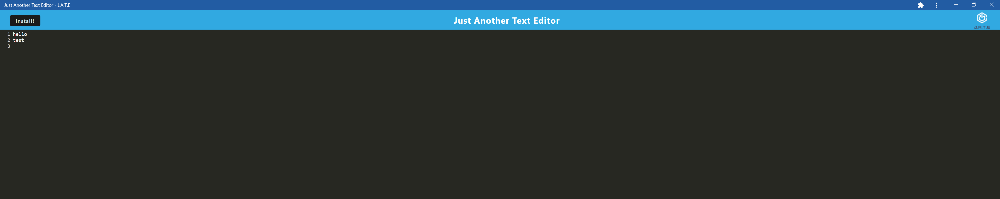

# Text-Editor-PWA 

## Description

THis application allows the user write text on the browers or on an installable app.

## Table of Contents

- [Installation](#installation)
- [Usage](#usage)
- [License](#license)
- [Contributing](#contributing)
- [Tests](#tests)
- [Questions](#questions)

## Installation

run npm i, then npm start:dev

## Usage

Click install button to install app to desktop

## License

No license

## Contributing

I worked with Marcus Paccapaniccia. His github is https://github.com/mpacct

## Tests

none

## Questions

Github username: [nickrosales](https://www.github.com/nickrosales)

Email: nickrosales68@gmail.com

  